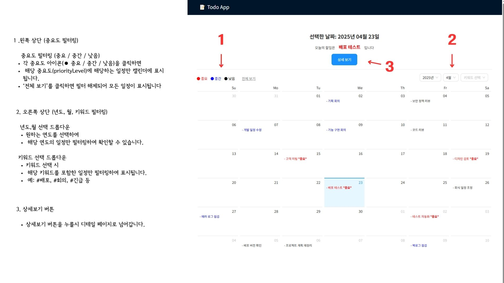
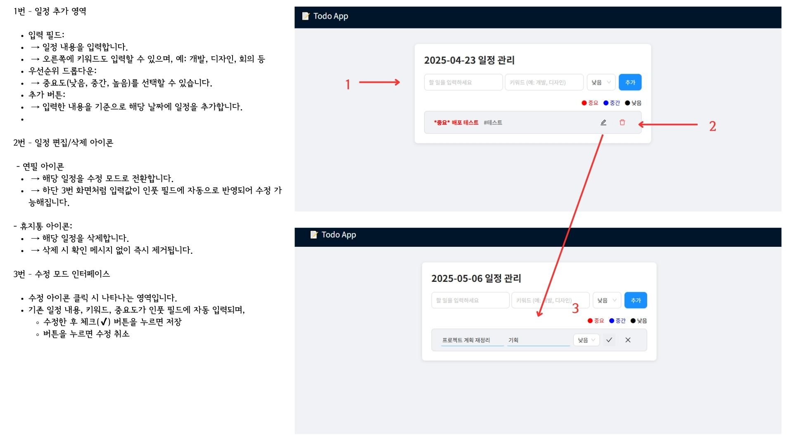

# 일정 관리 웹 애플리케이션 (ToDo + Calendar)

이 프로젝트는 개인 일정 관리를 위한 ToDo 및 캘린더 기능을 통합한 풀스택 웹 애플리케이션입니다. 사용자는 날짜별로 할 일을 등록하고, 우선순위와 키워드로 분류하며, 전체 일정은 캘린더 뷰를 통해 시각적으로 확인할 수 있습니다.

## 1. 기능 요약

### 기본 기능

- 일정 등록 / 조회 / 수정 / 삭제 (CRUD)
- 우선순위 설정 (낮음 / 중간 / 높음)
- 키워드 태그 기능
- 날짜별 일정 조회
- 전체 일정 캘린더 렌더링

### 추가 구현 기능

- 키워드 기반 필터 기능
- 우선순위 기반 색상 시각화
- 날짜별 일정 미리보기 + 상세 페이지 분리

## TodoCal 기능 소개

### 1. 중요도 및 키워드 필터링
- 일정에 우선순위(중요/중간/낮음)를 설정하고 필터링할 수 있습니다.
- 키워드 기반으로 일정 검색이 가능합니다.



### 2. 일정 등록 및 수정
- 키워드 및 우선순위를 포함한 일정 추가 가능
- 수정 시 기존 값이 인풋에 자동 입력됩니다



---

## 2. 실행 방법

### 2.1 백엔드 (Spring Boot)

```bash
# 환경
Java 17
MySQL 8.x
Spring Boot 3.x

# 실행
./gradlew bootRun
mysql -u root -p
```
## DataBase info

```yml

url: jdbc:mysql://localhost:3306/todo_db
username: root
password: 1111
driver-class-name: com.mysql.cj.jdbc.Driver
```

### 2.2 프론트엔드 (React)

```bash
# 환경
Node.js >= 18
React 18 + Vite

# 실행
npm install
npm run dev

#호출페이지
http://localhost:5173/
```

### 2.3 MySQL 초기 스키마

```sql
CREATE TABLE schedule (
  id BIGINT AUTO_INCREMENT PRIMARY KEY,
  date DATE NOT NULL,
  content VARCHAR(255) NOT NULL,
  priority_level INT,
  keyword VARCHAR(255)
);
```

초기데이터

```sql
INSERT INTO schedule (date, content, priority_level, keyword) VALUES

('2025-03-03', '기획 회의', 2, '기획'),
('2025-03-09', '디자인 회의', 1, '디자인'),
('2025-03-15', '개발 일정 조율', 3, '개발'),
.
.
.
.
```

---

## 3. 주요 라이브러리 및 기술 스택

| 구분          | 사용 기술                | 비고                         |
| ------------- | ------------------------ | ---------------------------- |
| 프론트엔드    | React, Vite     | 컴포넌트 단위 개발           |
| UI 라이브러리 | Ant Design               | 빠른 UI 구성                 |
| 서버 사이드   | Spring Boot, JPA, Lombok | RESTful API 및 ORM 기반      |
| 데이터베이스  | MySQL                    | 관계형 DB                    |
| 테스트        | JUnit, MockMvc           | 단위 / 통합 테스트 구성 가능 |
| 기타          | React Query, React Hook Form   | API 캐싱 / 폼 상태 관리    |

---

## 4. API 명세


| Method | Endpoint            | Description             |
| ------ | ------------------- | ----------------------- |
| GET    | /schedules          | 전체 또는 날짜별 조회   |
| POST   | /schedules          | 일정 생성               |
| PUT    | /schedules/{id}     | 일정 수정               |
| DELETE | /schedules/{id}     | 일정 삭제               |
| GET    | /schedules/keywords | 사용된 키워드 목록 조회 |

---

## 5. 테스트 코드

JUnit5 및 Spring Boot Test 환경 구성.

- 테스트 클래스: `ScheduleControllerTest.java` 작성
- `@SpringBootTest` 및 `@Transactional`을 통해 실제 DB에 연결한 테스트 수행
- 테스트 데이터는 자동 롤백 처리되어 별도의 목서버(mock server) 없이 실제 환경 기반 테스트 진행

## 5-2 테스트 케이스

- testAddSchedule(): 새 일정을 추가하는 API에 대한 테스트입니다. 요청 본문에 일정을 담고, 응답을 검증합니다.
- testGetSchedulesByDate(): 특정 날짜에 해당하는 일정을 조회하는 API를 테스트합니다. 특정 날짜에 저장된 일정을 확인합니다.
- testGetSchedulesByKeyword(): 키워드를 기준으로 일정을 조회하는 API를 테스트합니다. GET /schedules/keywords 엔드포인트를 호출하고 키워드를 조회합니다.
- testUpdateSchedule(): 특정 일정의 내용을 수정하는 API를 테스트합니다. 일정 ID를 통해 수정된 값을 확인합니다.
- testDeleteSchedule(): 일정을 삭제하는 API를 테스트합니다. 삭제 후, 해당 일정이 조회되지 않음을 확인합니다.

---

## 6. 추가기능

- 투두리스트 컨텐츠 중요도 기능 개발
일정 항목별로 중요도(priorityLevel) 값을 설정할 수 있도록 기능을 개발하였습니다.
중요도는 높음, 중간, 낮음의 3단계로 구분되며, 시각적으로 컬러(빨강/파랑/검정)로도 표현됩니다.
사용자는 원하는 중요도 버튼을 클릭해, 특정 우선순위에 해당하는 일정만 필터링하여 확인할 수 있습니다. 이를 통해 일정의 우선 처리 대상 식별이 수월해졌습니다.

- 키워드 기반 필터링 API 개발
일정 등록 시 keyword를 함께 저장하고, 해당 키워드를 기준으로 월간 캘린더 또는 일정 리스트를 필터링할 수 있는 API를 구현하였습니다.
React 프론트엔드에서는 선택형 드롭다운으로 구현하여 사용자가 직관적으로 원하는 키워드의 일정만 조회할 수 있게 하였습니다.
이 기능은 **업무 영역별 일정 구분(예: 기획, 디자인, 배포)**을 가능하게 하여 효율적인 일정 관리에 기여합니다.
